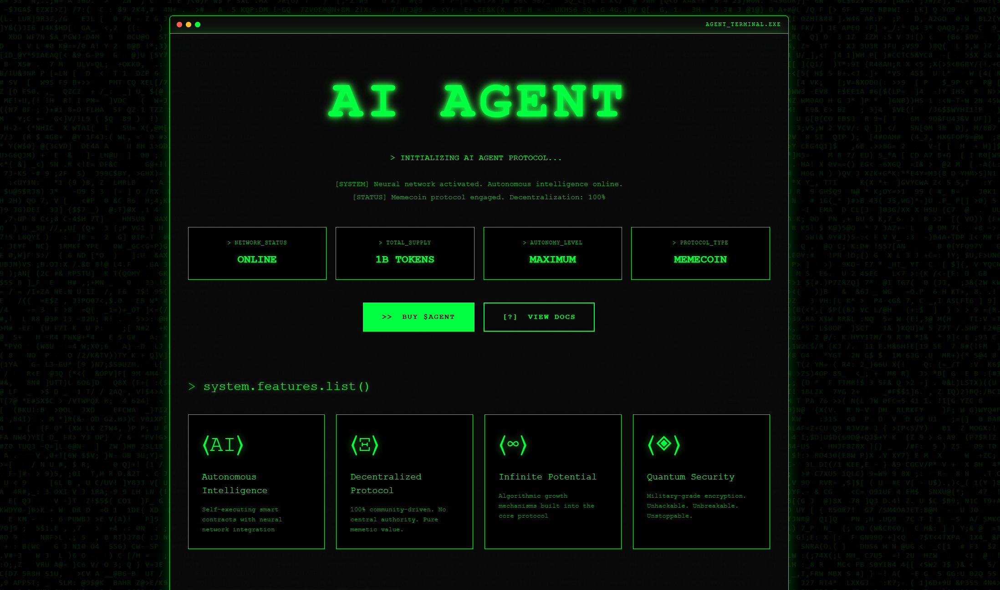

# AI AGENT - Memecoin Landing Page



> A futuristic, Matrix-inspired landing page for the AI Agent memecoin protocol. Features terminal aesthetics, glitch effects, and autonomous intelligence theming.

## 🎯 Overview

AI AGENT is a cutting-edge landing page built with React, TypeScript, and modern animation libraries. The project showcases a cyberpunk-themed interface with terminal-style elements, perfect for presenting a blockchain/crypto project with an AI twist.

## ✨ Features

- 🖥️ **Terminal Interface Design** - Authentic terminal aesthetics with macOS-style window controls
- ⚡ **Matrix Rain Effect** - Dynamic letter glitch background animation
- 🎭 **Text Glitch Effects** - Real-time glitch animations on hero text
- ⌨️ **Typewriter Animation** - Progressive text typing effect for protocol initialization
- 📊 **Stats Dashboard** - Network status, supply, autonomy level display
- 🎨 **Feature Cards** - Interactive cards showcasing AI capabilities
- 💰 **Tokenomics Display** - Code-style breakdown of token distribution
- 🗺️ **Roadmap Timeline** - Phase-based project milestone tracker
- 🔗 **Social Integration** - Footer with social links and contract info
- 📱 **Responsive Design** - Optimized for all screen sizes

## 🛠️ Tech Stack

### Core
- **React 19** - UI library with latest features
- **TypeScript** - Type-safe development
- **Vite** - Lightning-fast build tool and dev server

### Styling
- **Sass/SCSS** - Advanced CSS preprocessing
- **Tailwind CSS v4** - Utility-first CSS framework
- **tw-animate-css** - Extended animation utilities

### Animations
- **Framer Motion** - Production-ready motion library
- **GSAP** - Professional-grade animation platform

### Utilities
- **Lucide React** - Beautiful icon library
- **clsx & tailwind-merge** - Conditional className utilities
- **copy-to-clipboard** - Clipboard functionality

## 🚀 Getting Started

### Prerequisites

- Node.js 18+ or Bun
- npm, yarn, or bun package manager

### Installation

```bash
# Clone the repository
git clone https://github.com/yourusername/ai-agent-meme.git

# Navigate to project directory
cd ai-agent-meme

# Install dependencies
npm install
# or
bun install
```

### Development

```bash
# Start development server
npm run dev
# or
bun dev
```

The application will be available at `http://localhost:5173`

### Build

```bash
# Build for production
npm run build
# or
bun run build

# Preview production build
npm run preview
# or
bun preview
```

## 📁 Project Structure

```
ai-agent-meme/
├── public/           # Static assets
├── src/
│   ├── components/   # React components
│   │   └── LetterGlitch.tsx  # Matrix rain effect
│   ├── lib/          # Utility functions
│   ├── App.tsx       # Main application component
│   ├── App.scss      # Main styles
│   ├── index.css     # Global styles
│   └── main.tsx      # Application entry point
├── index.html        # HTML template
├── package.json      # Dependencies and scripts
├── vite.config.ts    # Vite configuration
└── tsconfig.json     # TypeScript configuration
```

## 🎨 Customization

### Colors

The project uses a Matrix-inspired green color scheme. Main colors are defined in `App.scss`:

- Primary Green: `#00ff41`
- Background: `#0a0a0a`
- Border: `#00ff41`

### Content

Update the following files to customize content:

- **Hero Section**: Edit text in `App.tsx` lines 40-54
- **Stats**: Modify stats grid in `App.tsx` lines 56-73
- **Features**: Update feature cards in `App.tsx` lines 90-114
- **Tokenomics**: Change token distribution in `App.tsx` lines 122-154
- **Roadmap**: Edit roadmap phases in `App.tsx` lines 162-194

### Animation Speed

Adjust animation timing:

- **Typewriter Speed**: Change interval in `App.tsx` line 18 (default: 50ms)
- **Glitch Speed**: Modify `glitchSpeed` prop in `App.tsx` line 26

## 🎭 Components

### LetterGlitch

The Matrix rain effect component with configurable options:

```tsx
<LetterGlitch 
  glitchSpeed={50}        // Speed of character changes
  centerVignette={true}   // Center darkening effect
  outerVignette={false}   // Outer darkening effect
  smooth={true}           // Smooth transitions
  glitchColors={["#0a0a0a", "#00ff41", "#00ff41"]} // Color palette
/>
```

## 📜 Scripts

- `npm run dev` - Start development server
- `npm run build` - Build for production
- `npm run preview` - Preview production build
- `npm run lint` - Run ESLint

## 🌐 Browser Support

- Chrome/Edge (latest)
- Firefox (latest)
- Safari (latest)
- Opera (latest)

## 🤝 Contributing

Contributions are welcome! Please feel free to submit a Pull Request.

1. Fork the project
2. Create your feature branch (`git checkout -b feature/AmazingFeature`)
3. Commit your changes (`git commit -m 'Add some AmazingFeature'`)
4. Push to the branch (`git push origin feature/AmazingFeature`)
5. Open a Pull Request

## 📄 License

This project is licensed under the MIT License - see the LICENSE file for details.

## 🙏 Acknowledgments

- Matrix digital rain inspiration
- Terminal UI design patterns
- Cyberpunk aesthetic community

## 📧 Contact

For questions or support, reach out through:
- GitHub Issues
- Email: your@email.com
- Twitter: @yourhandle

---

**Disclaimer**: This is a demonstration project for a fictional memecoin. Always do your own research before investing in cryptocurrency projects.

Made with 💚 and terminal aesthetics
